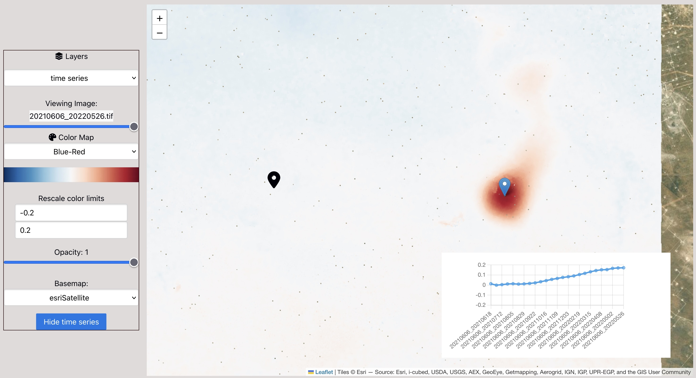

# Bowser

Map-based viewer for InSAR time-series outputs — GeoZarr cubes, dolphin workflow directories, or loose GeoTIFFs — served through a local FastAPI server and rendered by titiler in the browser.



## Quickstart

Zero-install — run the latest release against a GeoZarr cube:

```bash
uvx --from bowser-insar bowser run --stack-file example-cube.zarr
```

Open the `http://127.0.0.1:8000` link that bowser prints.

> **Note on PyPI installing an GDAL**: The PyPI wheel is enough for GeoZarr cubes
> and plain GeoTIFFs. For other input formats, `pixi` is the easiest way:
>
> ```bash
> pixi global install bowser-insar
> ```

**Installation in another project**

```bash
# GeoZarr / GeoTIFF only
pip install bowser-insar       # or: uv add bowser-insar

# Full format support (NetCDF, HDF5, VRT) via conda-forge GDAL
pixi add bowser-insar
```

## Quickstarts

### From [`dolphin`](https://github.com/isce-framework/dolphin)

`bowser setup-dolphin` scans a dolphin work directory and writes a
`bowser_rasters.json` describing every raster group it finds. `bowser run`
then serves them.

```bash
bowser setup-dolphin work/
bowser run
```

**Note:** these outputs must be **geocoded** to work with bowser, which lays them out on a basemap using web mapping tools.

If you're running over ssh, tunnel the port back to your laptop:

```bash
ssh -N -L 8000:localhost:8000 myserver
```

### From [`dolphin`](https://github.com/isce-framework/dolphin) → GeoZarr cube

Once the `bowser_rasters.json` file is created, you can convert the data into a GeoZarr cube:

```bash
pixi run -e writer bowser tifs-to-geozarr \
    --pyramid bowser_rasters.json cube.zarr
```

### DISP-S1 → GeoZarr cube

To work with DISP-S1 products, you may convert them once into a single pyramidal GeoZarr cube, then serve that. The converter handles the reference-date bookkeeping for morving temporal reference,, builds multiscale pyramids, and writes GeoZarr convention attributes so titiler can pick the right overview per tile zoom.

```bash
# 1. prepare per-band GeoTIFFs and a bowser_rasters.json
bowser setup-disp-s1 /path/to/disp-s1/outputs

# 2. convert to a single sharded GeoZarr cube with pyramid
pixi run -e writer bowser tifs-to-geozarr \
    --pyramid bowser_rasters.json cube.zarr

# 3. serve
bowser run --stack-file cube.zarr
```

For a **multi-dataset catalog** (pick from a map of bounding boxes at startup) and an **EC2 deployment** serving cubes from a private S3 bucket, see [`deploy/README.md`](deploy/README.md) for the `bowser register` CLI, the Docker image, and the EC2 bootstrap script end-to-end.

## CLI Usage

```bash
$ bowser --help
Commands:
  prepare-amplitude      Convert complex SLC GeoTIFFs to amplitude-in-dB.
  prepare-disp-s1        Create VRTs pointing into DISP-S1 NetCDFs.
  prepare-nisar-gunw     Create VRTs pointing into NISAR GUNW NetCDFs.
  register               Add a dataset entry to a catalog TOML file.
  run                    Run the web server.
  set-data               Specify what raster data to use (interactive).
  setup-aligned-disp-s1  Write bowser_rasters.json for aligned DISP-S1.
  setup-disp-s1          Write bowser_rasters.json for DISP-S1 outputs.
  setup-dolphin          Write bowser_rasters.json for a dolphin run.
  setup-hyp3             Write bowser_rasters.json for HyP3 Gamma.
  setup-nisar-gunw       Write bowser_rasters.json for NISAR GUNW.
```

## Developer setup

```bash
git clone git@github.com:opera-adt/bowser.git && cd bowser
pixi install            # default env: runtime deps
pixi install -e writer  # optional env: includes geozarr-toolkit for the converter
pixi run bowser run
```

Frontend (TypeScript + Vite):

```bash
npm install
npm run build   # rebuilds src/bowser/dist/ after .tsx / CSS changes
```

The PyPI wheel bundles `src/bowser/dist/` (built by the CD workflow before publishing), so end users can `pip install bowser-insar` without Node. From a git checkout, run `npm run build` first to populate `src/bowser/dist/` before `pip install -e .`.

For a hot-reload loop on UI/styling changes, run the backend and the
Vite dev server in two terminals. Vite proxies API calls to the
backend on port 8000:

```bash
# Terminal 1 — backend
pixi run bowser run

# Terminal 2 — frontend with HMR on http://localhost:5173
npm run dev
```

Override the backend URL with `VITE_API_URL=http://localhost:8001 npm run dev`.

## Legacy workflows

### DISP-S1 via VRTs (pre-GeoZarr)

The older path is to make a GDAL VRT per NetCDF variable and let bowser
read through those. This predates `bowser tifs-to-geozarr` and has
two drawbacks: remote NetCDF/HDF5 reads are slow (no standard overview
format), and VRTs require a conda-forge GDAL with the NetCDF driver.

Kept working, but prefer the GeoZarr path above for new setups.

```bash
mkdir my_disp_files; cd my_disp-files
s5cmd --numworkers 4 cp 's3://opera-bucket/OPERA_L3_DISP-S1_IW_F11115*/*.nc' .
bowser prepare-disp-s1 -o vrts *.nc
bowser setup-disp-s1 vrts
bowser run
```

## License

Copyright 2024, by the California Institute of Technology. ALL RIGHTS RESERVED. United States Government Sponsorship acknowledged. Any commercial use must be negotiated with the Office of Technology Transfer at the California Institute of Technology.

This software may be subject to U.S. export control laws. By accepting this software, the user agrees to comply with all applicable U.S. export laws and regulations. User has the responsibility to obtain export licenses, or other export authority as may be required before exporting such information to foreign countries or providing access to foreign persons.
